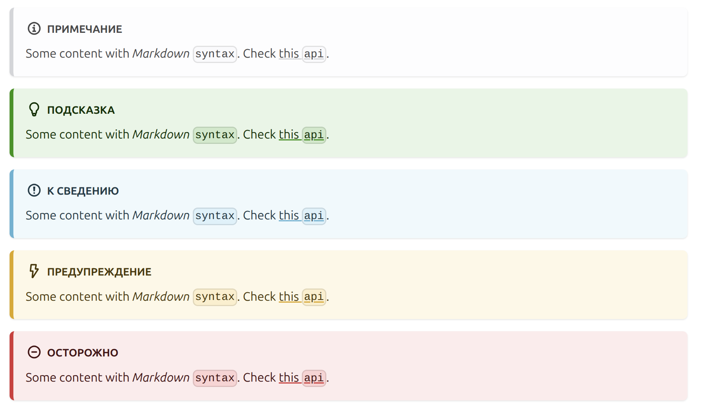
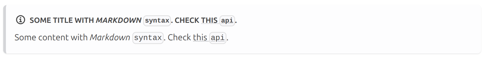
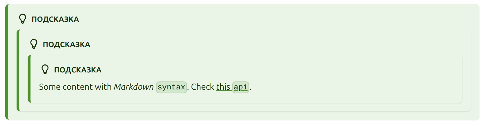

# Примечания в MDX

## Базовое использование

Для использования - добавь 3 двоеточия, за которыми следует тип примечания (_note, danger, warning, tip, info_)

```markdown
:::note

Some content with _Markdown_ `syntax`. Check [this `api`](#).

:::
```

```markdown
:::tip

Some content with _Markdown_ `syntax`. Check [this `api`](#).

:::
```

```markdown
:::info

Some content with _Markdown_ `syntax`. Check [this `api`](#).

:::
```

```markdown
:::warning

Some content with _Markdown_ `syntax`. Check [this `api`](#).

:::
```

```markdown
:::danger

Some content with _Markdown_ `syntax`. Check [this `api`](#).

:::
```



Для того, чтобы не было проблем с Prettier при форматировании MD/MDX файлов добавьте пустые строки вокруг открывающих и закрывающих директив:

- Правильно :white_check_mark:

  ```markdown
  :::note

  Some content with _Markdown_ `syntax`. Check [this `api`](#).

  :::
  ```

- Неправильно :x:

  ```markdown
  :::note
  Some content with _Markdown_ `syntax`. Check [this `api`](#).
  :::
  ```

## Пользовательский заголовок

Можно заменить дефолтный заголвок блока примечания, добавив его после типа примечания в квадратных скобках

```markdown
:::note[Some title with _Markdown_ `syntax`. Check [this `api`](#).]

Some content with _Markdown_ `syntax`. Check [this `api`](#).

:::
```



## Вложенные примечания

Примечания могут быть вложены друг в друга, для этого необходимо добавить дополнительное двоеточие

```markdown
:::::tip

::::tip

:::tip

Some content with _Markdown_ `syntax`. Check [this `api`](#).

:::
::::
:::::
```



## Примечания с MDX

В примечаниях возможно использовать MDX/React компоненты, например:

```markdown
:::tip

<Video src="/video/zones.mp4" width="880px" autoPlay />

:::
```

```markdown
:::tip

<HtmlExampleWithSrcCode>
{`
<html lang="en">
    <head>
        ...
    </head>
</html>
`}
</HtmlExampleWithSrcCode>

:::
```
